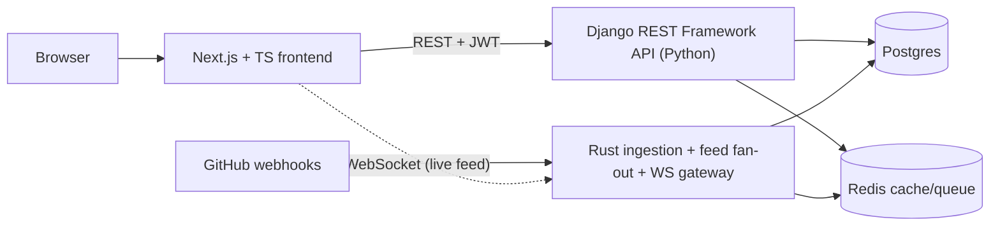

# Scale ThreadSpace into an Open-Source Build-in-Public Social Platform

> Living roadmap. Phases 0-4 are done and the full stack is containerized
> (`docker compose up`). Code review is the current focus; deployment (Oracle
> Always Free tier) is deferred.

## The product angle (unique, not Reddit, not Instagram)

ThreadSpace becomes a **social network for the open-source world** - a "build in public" feed for developers and the projects they work on.

What makes it distinct:

- **Identity- and project-centric**, not topic/community + voting (that's Reddit). You follow _people_ and _projects/repos_, not "subreddits".
- Posts ("devlogs") can **attach real GitHub artifacts** - a repo, release, commit, PR, or issue - which get auto-enriched (title, language, stars) via the GitHub API.
- **Project pages**: contributors, tech-stack tags, an activity timeline, "follow this project".
- **Connect your GitHub** (OAuth): import repos, optionally auto-post new releases via webhooks.
- Reactions + light threaded comments, a personalized feed, and a contribution/activity graph.

This keeps the social primitives we already have (profiles, posts, follow, likes) but reframes them around OSS work.

## Recommended stack (Python + TS + Rust)

- **Backend API**: Django + Django REST Framework (Python) - clean models, JWT auth, OpenAPI docs, pytest tests.
- **Frontend**: Next.js + TypeScript + Tailwind - modern, polished UI replacing the static UIkit templates.
- **Rust service**: high-throughput GitHub webhook ingestion + activity-feed fan-out + a WebSocket gateway for the live feed (axum + tokio, optional Redis pub/sub for multi-instance fan-out).
- **Infra (local)**: full stack via `docker compose` (Postgres + Redis + API + Rust gateway + frontend). Deployment to Oracle free tier deferred.

## Phase 0 - Foundations and cleanup (done)

- Rewrote `core/models.py` with real relationships: `Post.user` as `ForeignKey`, timezone-aware `auto_now_add`, `Like`/`Follow` with `ForeignKey`s + unique constraints, DB indexes.
- Replaced the Python `chain()` feed loop in `core/views.py` with a single ORM query.
- Moved `SECRET_KEY`/`DEBUG`/`ALLOWED_HOSTS`/`CSRF_TRUSTED_ORIGINS`/database config to env via `django-environ`.
- Fixed the unsafe like-via-GET (`/like-post`) to POST.
- Modernized deps: Django 4.2 -> 5.x, cleaned `requirements.txt`, added `pyproject.toml`.
- Tooling: `ruff`, `pytest` + `pytest-django` + `factory_boy`, GitHub Actions CI, `.env.example`, filled in `core/tests.py`.

## Phase 1 - Django REST Framework API (done)

- Added DRF, SimpleJWT, drf-spectacular, django-cors-headers.
- Architecture decision: kept domain models in `core` and added a dedicated, versioned `api`
  app for the REST layer (serializers/views/permissions/pagination). Avoids risky cross-app
  model relocation with no current payoff; can still split later.
- Added a `Comment` model (light threading via `parent`).
- Serializers + ViewSets + router under `/api/v1/`: register, JWT token/refresh, `me`,
  profiles (+ follow/followers/following), posts (CRUD + cursor-paginated `feed` + `like`),
  comments, search. OpenAPI schema at `/api/schema/`, Swagger UI at `/api/docs/`.
- 24 tests passing (auth, permissions, feed scoping, like/follow toggles, comments, search).

## Phase 2 - Next.js + TypeScript frontend (core app done)

- Built `frontend/` (Next.js 16 App Router, TS, Tailwind v4, TanStack Query) with a
  dark-first, GitHub/Linear-style design system.
- JWT auth (token store + transparent refresh), typed fetch client, auth context.
- Screens: login/register with route guards, infinite-scroll feed + composer, post cards
  with optimistic likes and inline comments, profile pages with follow/stats, user search.
  Production build + typecheck + lint all green.

## Phase 3 - GitHub integration (core differentiator done)

- `Repo` model caching enriched GitHub metadata (stars, forks, language, topics, etc.),
  plus an optional `Post.repo` link so devlogs can reference a project.
- GitHub enrichment service ([core/github.py](../core/github.py)): parses URLs/`owner/name`,
  fetches from the public GitHub API (optional `GITHUB_API_TOKEN`), and caches with a TTL.
- API: `POST /api/v1/github/resolve/`, `GET /api/v1/github/repos/<owner>/<name>/`,
  attach a repo on post create via `repo_full_name`, and `GET /posts/?repo=owner/name`.
- Frontend: composer "Repo" attach with live preview, repo cards on posts, and project
  pages at `/projects/[owner]/[name]` listing the project's devlogs.

## Phase 4 - Rust service + real-time (polyglot standout, done)

- Rust realtime gateway in [realtime/](../realtime) (axum + tokio): a separate,
  non-blocking delivery service so Django never waits on socket I/O.
  - **Webhook ingestion**: `POST /webhooks/github` verifies the
    `X-Hub-Signature-256` HMAC and turns published releases / non-empty pushes
    into activity events.
  - **Fan-out**: Django owns the social graph, so a `post_save` signal computes
    the author's followers and `POST`s the event (with audience) to the gateway's
    token-authenticated `/internal/publish`. Publishing is fire-and-forget on a
    background thread and a no-op when `REALTIME_URL` is unset.
  - **Live feed**: `GET /ws?user=<name>` streams targeted events; the in-memory
    Tokio broadcast hub filters each delivery by audience. Optional Redis pub/sub
    bridge (`--features redis`) for multi-instance fan-out.
  - **Frontend**: `useLiveFeed` hook subscribes over WebSocket (auto-reconnect
    with backoff) and surfaces a sticky "N new updates" pill that refetches the
    feed on click.
  - Verified: 11 Rust unit tests (signature, parsing, routing, hub), 4 Django
    fan-out tests, and a live WS + webhook end-to-end smoke test.

## Phase 5 - Containerization / local stack (done)

- Dockerfiles for all three services: Django API ([Dockerfile](../Dockerfile)),
  Rust gateway ([realtime/Dockerfile](../realtime/Dockerfile), multi-stage
  build -> slim Debian runtime), and the Next.js frontend
  ([frontend/Dockerfile](../frontend/Dockerfile), `output: "standalone"`).
- [docker-compose.yml](../docker-compose.yml) wires Postgres + Redis + the three
  services with healthchecks and persistent volumes. `docker compose up --build`
  brings the whole stack up with zero-config dev defaults; secrets are
  overridable via a root `.env`.
- `.dockerignore` per build context to keep images small and secret-free.
- Verified locally without Docker (tests + builds); a full `compose` build is the
  next thing to run during review (Docker not installed on the dev machine yet).

## Current status

- Phases 0-5 are complete. The app runs locally both natively and via
  `docker compose up --build`.
- **Now**: code review across all phases before planning further.
- **Known issue**: GitHub Dependabot flagged dependency vulnerabilities on the
  repo - triage during review.

## Backlog (optional, not started)

None of these are required for the project to run; they're the candidate next
steps once review wraps.

- Run a full `docker compose` build end-to-end (Docker not installed on the dev
  machine yet) and add a prod-like profile (gunicorn + `collectstatic` + service
  healthchecks).
- Persist webhook events to Postgres for a project activity timeline (today they
  are broadcast as live events only); optionally auto-post releases as devlogs.
- Generate the typed frontend client directly from the OpenAPI schema.
- Retire the legacy Django templates once the SPA fully replaces them; richer
  profile editing.
- Encrypt stored GitHub OAuth access tokens at rest before going wide.
- Deployment to Oracle Always Free: the prod stack (gunicorn + Caddy auto-HTTPS +
  GitHub Actions auto-deploy) is ready — see `docs/DEPLOY.md`. Remaining is the
  manual side: provision the VM, point DuckDNS, and fill `.env.production`.

## Notes / deferred

- Keep everything OSS - no proprietary SaaS dependencies.
- Keep the repo runnable at the end of every phase.
