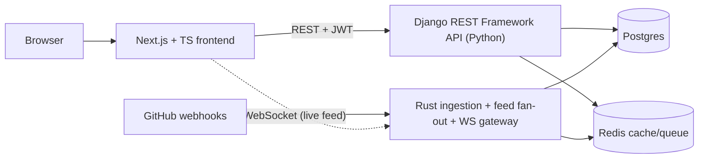

# Scale ThreadSpace into an Open-Source Build-in-Public Social Platform

> Living roadmap. Phase 0 is in progress. Deployment (Oracle Always Free tier) is deferred.

## The product angle (unique, not Reddit, not Instagram)

ThreadSpace becomes a **social network for the open-source world** - a "build in public" feed for developers and the projects they work on.

What makes it distinct:

- **Identity- and project-centric**, not topic/community + voting (that's Reddit). You follow _people_ and _projects/repos_, not "subreddits".
- Posts ("devlogs") can **attach real GitHub artifacts** - a repo, release, commit, PR, or issue - which get auto-enriched (title, language, stars) via the GitHub API.
- **Project pages**: contributors, tech-stack tags, an activity timeline, "follow this project".
- **Connect your GitHub** (OAuth): import repos, optionally auto-post new releases via webhooks.
- Reactions + light threaded comments, a personalized feed, and a contribution/activity graph.

This keeps the social primitives we already have (profiles, posts, follow, likes) but reframes them around OSS work.

## Recommended stack (Python + TS + Rust)

- **Backend API**: Django + Django REST Framework (Python) - clean models, JWT auth, OpenAPI docs, pytest tests.
- **Frontend**: Next.js + TypeScript + Tailwind - modern, polished UI replacing the static UIkit templates.
- **Rust service**: high-throughput GitHub webhook ingestion + activity-feed fan-out + a WebSocket gateway for the live feed (axum + sqlx + redis).
- **Infra (local only for now)**: Postgres + Redis via `docker-compose`. Deployment to Oracle free tier deferred.

## Phase 0 - Foundations and cleanup (in progress)

- Rewrite `core/models.py` with real relationships: `Post.user` as `ForeignKey`, timezone-aware `auto_now_add`, `Like`/`Follow` with `ForeignKey`s + unique constraints, DB indexes.
- Replace the Python `chain()` feed loop in `core/views.py` with a single ORM query.
- Move `SECRET_KEY`/`DEBUG`/`ALLOWED_HOSTS`/`CSRF_TRUSTED_ORIGINS`/database config to env via `django-environ`.
- Fix the unsafe like-via-GET (`/like-post`) to POST.
- Modernize deps: Django 4.2 -> 5.x, clean `requirements.txt`, add `pyproject.toml`.
- Tooling: `ruff`, `pytest` + `pytest-django` + `factory_boy`, GitHub Actions CI, `.env.example`. Fill in `core/tests.py`.

## Phase 1 - Django REST Framework API (done)

- Added DRF, SimpleJWT, drf-spectacular, django-cors-headers.
- Architecture decision: kept domain models in `core` and added a dedicated, versioned `api`
  app for the REST layer (serializers/views/permissions/pagination). Avoids risky cross-app
  model relocation with no current payoff; can still split later.
- Added a `Comment` model (light threading via `parent`).
- Serializers + ViewSets + router under `/api/v1/`: register, JWT token/refresh, `me`,
  profiles (+ follow/followers/following), posts (CRUD + cursor-paginated `feed` + `like`),
  comments, search. OpenAPI schema at `/api/schema/`, Swagger UI at `/api/docs/`.
- 24 tests passing (auth, permissions, feed scoping, like/follow toggles, comments, search).

## Phase 2 - Next.js + TypeScript frontend

- New `frontend/` app (App Router, TS, Tailwind, TanStack Query); rebuild feed/profile/project/composer/search/auth; retire Django templates; typed client from OpenAPI.

## Phase 3 - GitHub integration (the differentiator)

- GitHub OAuth + "Connect GitHub" (encrypted tokens); attach/enrich GitHub artifacts; project pages from imported repos.

## Phase 4 - Rust service + real-time (polyglot standout)

- Rust service (axum + sqlx + redis): webhook ingestion (signature-verified), feed fan-out via Redis, WebSocket live-feed endpoint for the Next.js feed.

## Notes / deferred

- Deployment out of scope for now (Oracle Always Free tier later, not Railway); `docker-compose` stays local-only.
- Keep everything OSS - no proprietary SaaS dependencies.
- Keep the repo runnable at the end of every phase.
